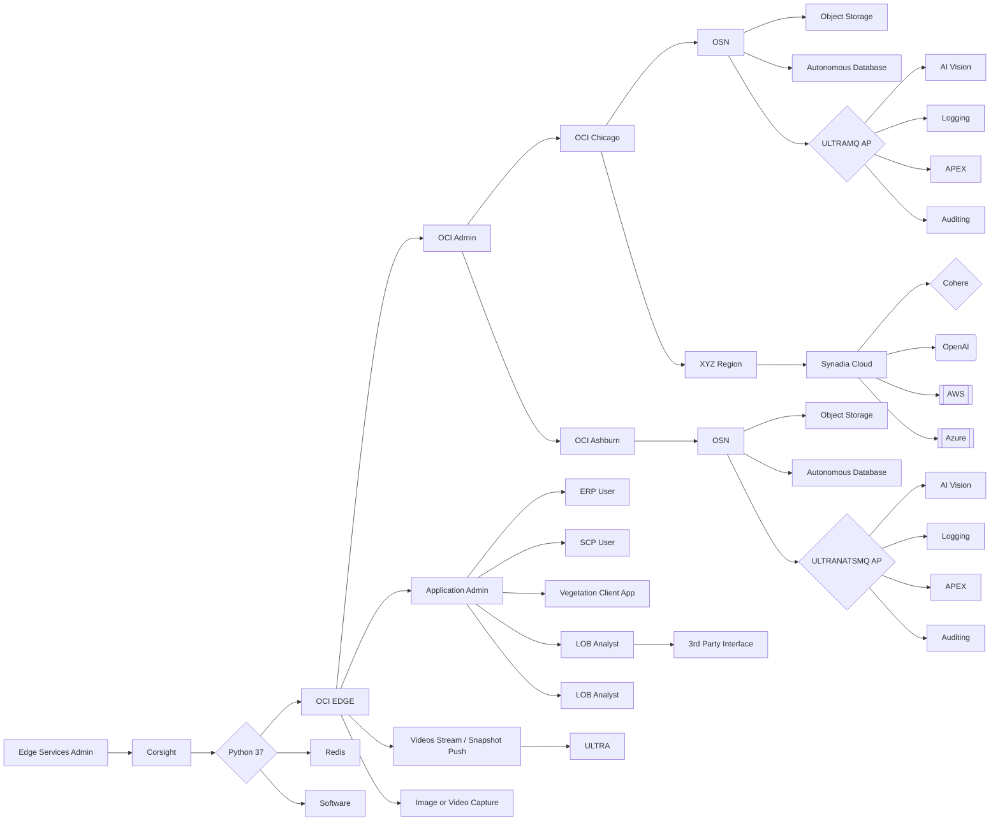

## SIGnopsis: Edge AI R&D PI - 

Role: Chief Architect - FY24 Accenture Oracle Mastermind Hackathon 

This tool demonstrates how to use AI at the edge for raw data to executive synopsis & intelligence reporting for agnostic raw source data via a land-air-water-space network data fabric mesh.

**How It Works**

* The core is a Go program named "synopsis.go".
* It frontloads AI API to generate executive synopsis and intelligence reporting that are relevant to raw data context at the edge.
* A frontend (e.g., built with a template like the UFO Alien Template) provides a user interface for interacting with the chatbot.
* This Proof of Concept can be leveraged on Cohere's Powerful `command-r-plus` model at 128k token output on AuthN/AuthZ silo'd LOB data
*

**File Structure**
```
edge-ai-service/
├── .models.{theoretical}/
│   └── x.ai.grok.alpha.200b.params
│   └── mistral.latest.bin
│   └── llama.latest.bin
│   └── custom.bin.public.private.access
├── pkg/
│   └── synopsis/service.go
|   └── shared/subjects.go
├── cmd/microlith/
│       └── synopsis.go
├── .env
├── Dockerfile
└── README.md
```

**Architecture**

Refer to Pretty one at `./artifacts/architecture.png`


**Requirements**

* A Cohere API key ([https://cohere.ai](https://cohere.ai))
* Go programming language ([https://go.dev/](https://go.dev/))
* A frontend web framework or HTML template (optional, for the user interface)
* Nats.io Edge Messaging Fabric Technology ([https://nats.io](https://nats.io))

**Installation**

1. **Obtain a Cohere API key:** Sign up for a Cohere account and get your API key.
2. **Install Go:** Follow the instructions at [https://go.dev/doc/install](https://go.dev/doc/install)
3. **Clone or download this project:** This will give you the `synopsis.go` file.
4. **Set Environment Variable:** Set the `CO_API_KEY` environment variable with your Cohere API key.
   * **Linux/macOS:** `export CO_API_KEY=your_api_key; export NATS_URL=your_nats_global_super_cluster`
   * **Windows:** Use the System Properties settings.

**Development and Testing**
```bash
# Add your nkey credentials file
-----BEGIN NATS USER JWT-----
uuidv40xDAGeysuperdupersecretencryption123ociwoohoosafracupnerd1241235123451235rqegrq245h
------END NATS USER JWT------

************************* IMPORTANT *************************
NKEY Seed printed below can be used to sign and prove identity.
NKEYs are sensitive and should be treated as secrets.

-----BEGIN USER NKEY SEED-----
superdupersecretencryption123ociwoohoosafracupnerd1241235123451235rqegrq245h
------END USER NKEY SEED------

*************************************************************
```
```
# Subscribe to synopsis messages anywhere🤓
nats sub "edge.ai.synopsis"
```
```bash
go mod download
go run ./cmd/microlith/synopsis.go
```

**Building and Running**

**1. Build the Go binary:**
```bash
go build ./cmd/microlith/synopsis.go
```

This will create an executable file named synopsis (or synopsis.exe on Windows)

2. Run the chatbot:

```bash
./synopsis -i "<co: 0>341 RSA2048-10-11T22:14:15.003Z edge.machine.oci-rover.ai su - ID47 - BOM'su root' failed for lonvick on /dev/pts/8"
```

Use code with caution.
The chatbot will start listening for input from the command line.

Frontend Integration (Optional)

Choose a frontend web framework (e.g., React, Vue.js, Svelte) or use a pre-built template like the UFO Alien Template.

Implement logic in your frontend to:

Send user queries to the synopsis executable (potentially running on a server).
Display the chatbot's responses from Cohere within the user interface.
