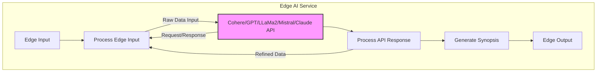

## yeet-cli: Edge AI Assistant

This tool demonstrates how to use the AI at the edge for raw data to natural language executive synopsis.

**Design**


**How It Works**

* The core of the chatbot is a Go program named "yeet.go".
* It utilizes the Cohere API to generate text responses that are relevant to raw data context at the edge.
* A frontend (e.g., built with a template like the UFO Alien Template) provides a user interface for interacting with the chatbot.

**File Structure**
```
edge-ai-service/
├── models (POTENTIAL)/
│   └── cohere.edge.bin (or similar model file)
├── pkg/
│   └── synopsis/service.go
├── pkg/
│   └── endpoints/service.go
├── cmd/microlith/
│       └── yeet.go
├── .env
├── Dockerfile
└── README.md
```

**Requirements**

* A Cohere API key ([https://cohere.ai](https://cohere.ai))
* Go programming language ([https://go.dev/](https://go.dev/))
* A frontend web framework or HTML template (optional, for the user interface)

**Installation**

1. **Obtain a Cohere API key:** Sign up for a Cohere account and get your API key.
2. **Install Go:** Follow the instructions at [https://go.dev/doc/install](https://go.dev/doc/install)
3. **Clone or download this project:** This will give you the `yeet.go` file.
4. **Set Environment Variable:** Set the `CO_API_KEY` environment variable with your Cohere API key.
   * **Linux/macOS:** `export CO_API_KEY=your_api_key`
   * **Windows:** Use the System Properties settings.

**Development and Testing**
```bash
go mod download
go run ./cmd/microlith/yeet.go
```

**Building and Running**

**1. Build the Go binary:**
```bash
go build ./cmd/microlith/yeet.go
```

This will create an executable file named yeet (or yeet.exe on Windows)

2. Run the chatbot:

```bash
./yeet -i <INPUT_EDGE_PROMPT>
```

Use code with caution.
The chatbot will start listening for input from the command line.

Frontend Integration (Optional)

Choose a frontend web framework (e.g., React, Vue.js, Svelte) or use a pre-built template like the UFO Alien Template.

Implement logic in your frontend to:

Send user queries to the yeet executable (potentially running on a server).
Display the chatbot's responses from Cohere within the user interface.